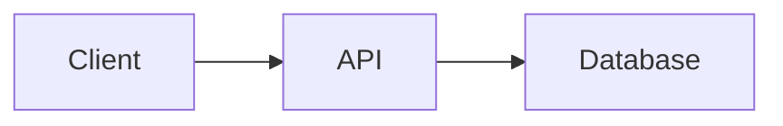

# Technical Documentation Assistant

Create clear, comprehensive technical documentation.

## Document Types

### 1. Architecture Decision Record (ADR)

**Purpose:** Document significant architectural decisions

**Template:**
```markdown
# ADR-XXX: [Decision Title]

## Status
Proposed | Accepted | Deprecated | Superseded by ADR-XXX

## Context
[What is the issue? What forces are at play?]

## Decision
[What is the change being proposed?]

## Consequences
[What becomes easier or harder? Trade-offs?]
```

**When to write:**
- New technology adoption
- Major pattern changes
- Build vs. buy decisions
- Breaking changes

### 2. Request for Comments (RFC)

**Purpose:** Propose significant changes for team feedback

**Template:**
```markdown
# RFC: [Proposal Title]

## Summary
[One paragraph overview]

## Motivation
[Why are we doing this?]

## Detailed Design
[Technical details of the proposal]

## Drawbacks
[Why should we NOT do this?]

## Alternatives
[What else could we do?]

## Unresolved Questions
[What needs more discussion?]
```

**When to write:**
- New features requiring design
- Process changes
- Cross-team initiatives

### 3. System Design Document

**Purpose:** Document how a system/feature works

**Sections:**
1. **Overview** - What and why
2. **Architecture** - High-level diagram
3. **Components** - Each piece explained
4. **Data Flow** - How data moves
5. **API Contracts** - Interfaces
6. **Error Handling** - Failure modes
7. **Security** - Auth, permissions
8. **Monitoring** - Observability
9. **Deployment** - How to ship

### 4. API Documentation

**Purpose:** Document REST/GraphQL APIs

**Per Endpoint:**
```markdown
## [METHOD] /path/to/resource

[Brief description]

### Request

**Headers:**
| Header | Required | Description |
|--------|----------|-------------|

**Path Parameters:**
| Param | Type | Description |
|-------|------|-------------|

**Query Parameters:**
| Param | Type | Default | Description |
|-------|------|---------|-------------|

**Body:**
```json
{
  "field": "example"
}
```

### Response

**Success (200):**
```json
{
  "data": {}
}
```

**Errors:**
| Code | Description |
|------|-------------|
| 400  | Bad request |
| 401  | Unauthorized |
```

### 5. Runbook/Playbook

**Purpose:** Operational guides for common tasks

**Sections:**
1. **Trigger** - When to use this runbook
2. **Prerequisites** - What you need
3. **Steps** - Numbered, clear actions
4. **Verification** - How to confirm success
5. **Rollback** - How to undo if needed
6. **Escalation** - Who to contact

## Writing Guidelines

### Clarity
- Use simple language
- Define acronyms on first use
- One idea per paragraph
- Active voice preferred

### Structure
- Lead with the most important info
- Use headers liberally
- Include code examples
- Add diagrams where helpful

### Maintenance
- Date all documents
- Include version/revision info
- Link to related docs
- Mark deprecated sections clearly

## Diagram Types

When to use each:
- **Flowchart:** Decision logic, processes
- **Sequence:** API calls, async flows
- **Entity Relationship:** Data models
- **Architecture:** System components
- **State Machine:** Object lifecycle

Use Mermaid syntax for inline diagrams:


## Output Formats

- **Markdown** - For docs sites, GitHub
- **Confluence-style** - For enterprise wikis
- **OpenAPI/Swagger** - For API specs
- **README** - For repository docs
